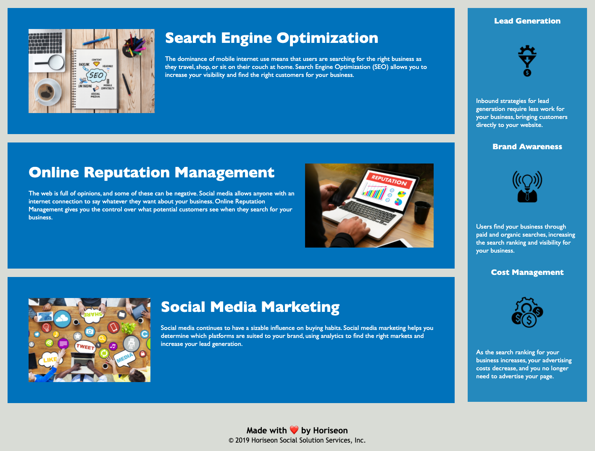

# Challenge Makeover

## Purpose

Refactoring a marketing solution webpage to meet accessibility standards.

## User Story

AS A marketing agency
I WANT a codebase that follows accessibility standards 
SO THAT our own site is optimized for search engines 

## Acceptance Criteria

GIVEN a webpage meets accessibility standards
* WHEN I view the source code
* THEN I find semantic HTML elements
* WHEN I view the structure of the HTML elements
* THEN I find that the elements follow a logical structure independent of styling and positioning
* WHEN I view the image elements
* THEN I find accessible alt attributes
* WHEN I view the heading attributes
* THEN they fall in sequential order
* WHEN I view the title element
* THEN I find a concise, descriptive title

## Built With 
* HTML
* CSS

## Website
https://lilyhi.github.io/challenge-makeover/

## Contribution
Made with ❤️ by Horiseon 
Refactored by Lily

Screenshots displaying full site:

